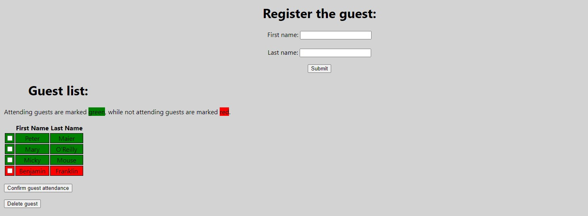

# react-guest-list-online

With this React application, it is easy to create a list of people, e.g. guests invited to an event. It is possible to enter first and last name and add the guest to the guest list.

Furthermore, it is possible to mark single guests as attending, as well as deleting single guests from the list.

The guest data is stored on a server deployed on Heroku.

Please run `yarn start` to start the application

[More info about the server](https://github.com/upleveled/express-guest-list-api-memory-data-store)

[Local version of the app](https://github.com/hedi-far/react-guest-list-local)

## To Do

- [ ] Confirming multiple guests at once does not work
- [ ] Deleting multiple guests at once does not work
